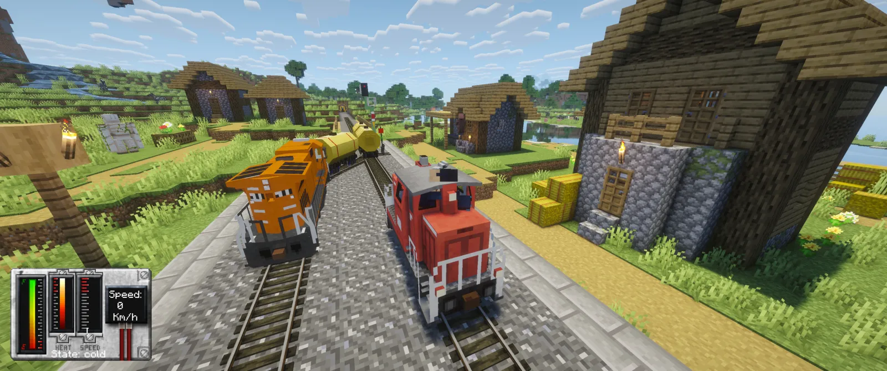
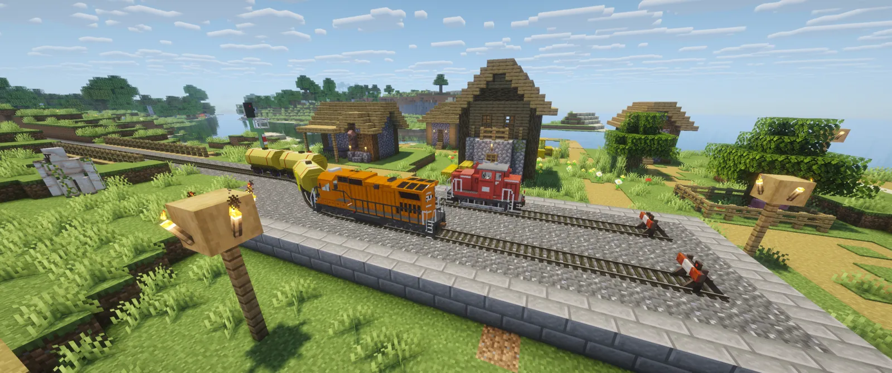

# Traincraft

Minecraft 26.2 mod built with NeoForge and Java 25.

Port of Traincraft to NeoForge by Mateusz Woźniak. Traincraft was originally created by
Spitfire4466 and Mrbrutal; the 1.7.10 Community Edition was maintained by EternalBlueFlame
and NitroxydeX.

Landing page and download: [traincraft.mateuszwozniak.com](https://traincraft.mateuszwozniak.com)





## Source Sets

- `main`: railway gameplay, vehicle simulation, client rendering and bundled definitions.
- `development`: GameTests and scripted client scenarios, excluded from the published JAR.
- `test`: unit tests and resource contract tests.
- `tools`: capture orchestration, image comparison and resource generators.

## Verification

Run from this directory:

```sh
./gradlew test compileDevelopmentJava compileToolsJava runGameTestServer jar
./gradlew trackitems
./gradlew runClient
```

`trackitems` generates item resources from the track catalog. GameTests cover placement
and removal of every catalog plan, adjacent assemblies, blocked placement, switching
and locomotive operation. Unit tests do not replace visual checks in the client.
